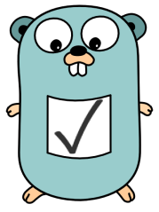
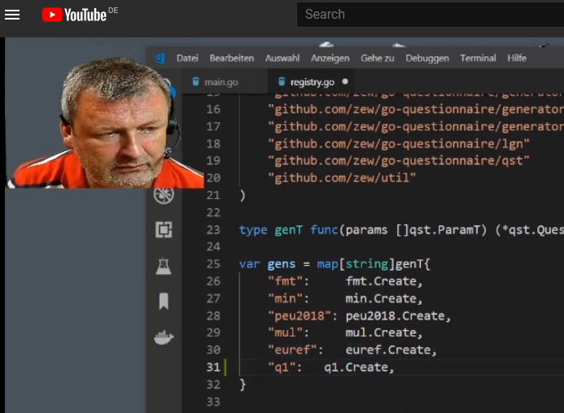
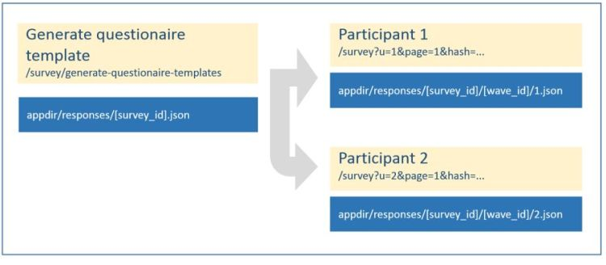
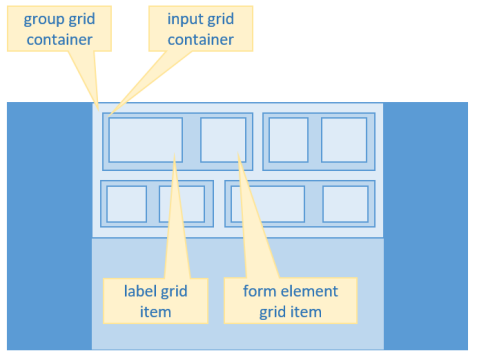
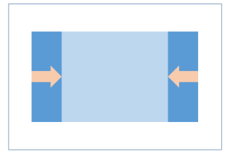
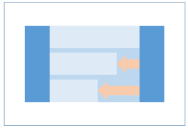
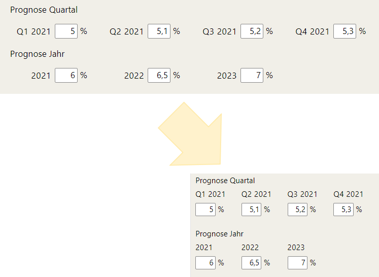
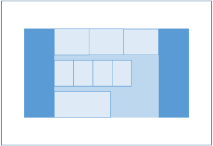
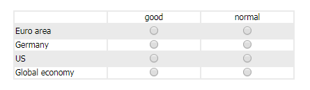

# Go-Questionnaire

<!-- github.com suppresses float, min-width, margin-* -->
<!-- github.com overrides max-width to 100% -->


[](https://godoc.org/github.com/zew/go-questionnaire)        [](https://travis-ci.com/zew/go-questionnaire)        [](https://goreportcard.com/report/github.com/zew/go-questionnaire)      [](https://codecov.io/gh/zew/go-questionnaire)

[](https://github.com/zew/go-questionnaire/actions/workflows/codecov.yml)

<!-- 
<div >&nbsp;</div>
<div >&nbsp;</div> 
-->

<!-- elements inside <div>...</div> are exempted from blackfriday markdown rendering -->
<div style="position: static">
    <div style="position: relative; left: 25px;">
        <ul>
            <li>LimeSurvey for Go lovers</li>
            <li>Creating and serving questionnaires</li>
            <li>Precise layout - no HTML fumble</li>
            <li>Support for mobile devices</li>
        </ul>
    </div>
</div>

<div style="clear:both"></div>

## Status

Version 2.0

Productive use at our research institute.

## Requirements

Go Version 1.__16__

### Non-technical properties

* Any number of surveys via single server - any path

* Secure login URLs < 65 characters in size

* Shortcut logins `example.com/d/A5FE3P`

* Automatic smartphone version

* Simple design of new questionnaires

* Layout freedom - without HTML fumbling

* Support for any number of languages - Polish, Russian, Chinese

* Text blocks, support pages in several languages - written in simple `markdown` format

* Fully dynamic questions based on login profile  

  * Distinct questions depending Euro membership

  * Distinct questions by industry sector

  * Dynamic questions based on previous answers

* Customization for each wave

  * Reference interest rates in question text

* Order of questions randomizable, but constant for each participant

* Easy changes during survey time; i.e. typos or question rewording

* Universal CSV export directly available to the researcher running the survey

* Documentation

* Open source license

* Published on github.com

### Partly technical properties

* Ready for deployment on [Google App Engine](https://en.wikipedia.org/wiki/Google_App_Engine)  
by using [gocloud blob](https://godoc.org/gocloud.dev/blob) for local file system and google buckets.

* `Docker` technology for easy installation on any cloud server

* Builtin `https` self configuration

* `CSRF` and `XSS` hack defense

* Consistence check for questionnaires - no duplicate field names, no missing translations

* Server self test - checks correctness of participant data entry for each questionnaire

* All content and all results are driven  
 by __JSON files__.  
 No database required.

* Data thrift: Surveys contain no personal data - only a participant ID, the questions and the answers.

* Stress test - 60 participants at once

### Boring properties

* Server side validation  
For example `must ; inRange20` or only `inRange100` or only `must`

* Server side validation  
complex rules via custom validation funcs  
which can access the entire questionnaire;  
i.e. `comprehensionPOP2`

* If the researcher needs instant feedback  
on user input, inclusion of page-wise `JavaScript` files possible

### Technical properties

* `loadtest` performs 60 concurrent requests 1.41 seconds - on 2018 Lenovo Notebook.

* Server self test on `travis-ci`; see build logs for details.  
Since 2021, `travis-ci` is not working anymore.

* The `transferrer` pulls in the responses from an internet server. Once inside your organization, the results are fed into any CSV or JSON reading application.

## Semantics

* This application serves any number of `surveys`.

* A `survey` is a `questionnaire` with one or more `waves` (repetitions).


## Setup

Install and setup [golang](https://golang.org/doc/install)

```bash
cd $HOME/go/src/github.com/zew
go get -u github.com/zew/go-questionnaire
cd go-questionnaire
mv config-example.json  config.json  # adapt to your purposes
mv logins-example.json  logins.json  # dito
touch ./templates/styles-quest-[survey].css # put your site's styles here
go build
./go-questionnaire                   # under windows: go-questionnaire.exe
```

More info in [deploy on linux/unix](./app-bucket/content/linux-instructions.md)

## Create new questionnaire `myquest`

<a href="https://youtu.be/zFasU5kAKvE" target="_new">  
   
</a>  

* Copy `generators/example` to `generators/myquest`

* Open `generators/myquest/main.go`  
and change package name: `package myquest`

* Add your new questionnaire to `generators/registry.go`  
`"myquest": myquest.Create,`

* In `generators/myquest/main.go`  
under `page := q.AddPage()` you can add  
additonal `pages`, `groups` and `inputs`.

* Additional groups are to change column layout within a page. Details below.

### Input types

* `text`       - your classic text input
* `number`     - number input - mobile browsers show the numbers keyboard
* `textarea`   - multi line text input
* `dropdown`   - list of fixed choices
* `checkbox`   - yes/no input
* `radio`      - grouped by name - differentiated by ValueRadio
* `hidden`

* `textblock`  - block of text without input
* `button`     - submit button

* `dyn-textblock` - `DynamicFunc="ResponseStatistics..."` dynamic text blocks
* `dyn-composite` - runtime executed, dynamic fragment,   multiple inputs and text; `dyn-composite-scalar` is a list of inputs contained in `dyn-composite`

Each input can have a multi-language label, -description, a multi-language suffix and a validation function.

Each input has a span. Its label and form element each have a sub-span.

## Dynamic content

`dynFuncT` and `CompositeFuncT` can be used to render real timy dynamic content
and question blocks.

## Create survey and logins

If you have created your survey `myquest` you need to restart the application.

* Login as admin at <https://dev-domain:port/survey/login-primitive>

* Create a questionnaire template - as JSON file  
 <https://dev-domain:port/survey/generate-questionnaire-templates>



* Generate login hashes for the survey id and wave id above  
   i.e.  <https://dev-domain:port/survey/generate-hashes?wave_id=2018-07&survey_id=fmt>  
  yielding
  
    /survey?u=99000&sid=fmt&wid=2018-07&h=57I7UVp6
    ...

### Participant login and reset

* Participants can now use these login links to [access the questionnaire](https://dev-domain:port/survey?u=98991&survey_id=fmt&wave_id=2018-07&h=4059d765e4a4f211658373c07c5affb9)

* Once logged in, they can [re-access the questionnaire](https://dev-domain:port/survey)

* For testing purposes, you may [reset the questionnaire](https://dev-domain:port/survey/reload-from-questionnaire-template?u=98991&survey_id=fmt&wave_id=2018-07&h=4059d765e4a4f211658373c07c5affb9)

### URL parameters for testing

* `page`=[0-9] - jump to page x

* `show-version=true` - show q.Version

Persisted to session:

* `skip_validation=true` - switch off mandatory validation

* `override_closure=true` - ignore questionnaire deadline and closure by user

## Deploy to appengine

### Docs

* [runtime](https://cloud.google.com/appengine/docs/standard/go112/runtime)
* [environment_variables](https://cloud.google.com/appengine/docs/standard/go112/config/appref#environment_variables)

### Remote

#### Deploy

```bash
gcloud config set project "financial-literacy-test"
gcloud app deploy
Y
# 
```

Read the logs

```bash
gcloud app logs tail -s default
```

Open in browser

```bash
gcloud app browse
```

#### URLs

* [Frontend](https://financial-literacy-test.appspot.com)
* [Backend](https://console.cloud.google.com/home/dashboard?project=financial-literacy-test)
* [Datastore](https://console.cloud.google.com/storage/browser/financial-literacy-test.appspot.com/?project=financial-literacy-test&src=ac)

#### Creation of signed URLs via cloud.google.com/go/storage

```bash
SET   GOOGLE_APPLICATION_CREDENTIALS=c:\Users\pbu\.ssh\google-cloud-rentomat-creds.json
ECHO %GOOGLE_APPLICATION_CREDENTIALS%
```

### Local

```bash
dev_appserver.py app.yaml
"c:\Program Files (x86)\Google\Cloud SDK\google-cloud-sdk\platform\bundledpython\python.exe" "c:\Program Files (x86)\Google\Cloud SDK\google-cloud-sdk\bin\dev_appserver.py" app.yaml
```

### Packages

* Package `qst` contains generic functions to create questionnaires.

* Common proof functions in `qst` prevent duplicate question keys  
 or missing translations.

* Package `generators` _uses_ qst for creating specific questionnaires.  

* Package `lgn` contains three authentication schemes for participants.  
  * Regular login via username and password.
  * Login via URL parameters for user ID, survey ID, wave ID and profile ID plus hash.
  * Login via [hash ID](https://hashids.org) with above parameters configured in `directLoginRanges`.  
  * Login via anonymous ID [(example)](https://financial-literacy-test.appspot.com/create-anonymous-id) -  
   with above parameters configured in `directLoginRanges`.  
   The anonymous ID is converted into an integer, which is encoded as a hash ID.  
   [QR code example](http://financial-literacy-test.appspot.com/img/ui/qr.png).  
Profiles are configured key-value sets who are copied into the logged-in user's attributes.  
  This way any number of user properties can be specified, while the login URL remains short or ultra short.

* Package `main` serves questionnaires via http(s).  
with automatic `Lets encrypt` certification.

* Directory `app-bucket/responses` stores indididual answers  
 (and initial questionnaire templates).

* `trl` contains the type `multi-language string` and  
 a global hyphenizations map for mobile layout.

* `cfg` contains universal multi-language strings.  
 Each `questionnaire` contains specific multi-language strings.  

* `css` contains double sets of CSS styles for `desktop` and `mobile`.  
`desktop` takes precedence.

* Package cloudio is a convenience wrapper around [Gocloud blob](https://godoc.org/gocloud.dev/blob)  
The entire persistence layer is moved from ioutil... to cloudio...  
Thus the application can be hosted by cloud providers with buckets or on classical webservers.

* Survey results are pulled in by the `transferrer`,  
 aggregating responses into a CSV file.  
 `transferrer` logic is agnostic to questionnaire structure.

* The `updater` subpackage automates in-flight changes to the questionnaire.  
No need for database "schema" artistry.  

#### Page navigation sequence - special pages

* Automatic navigation buttons and progress bar are provided for desktop and mobile layout.

In addition:

* Pages can be navigated by page number sequence using http params `previous` and `next`

* Pages can be navigated using `page` = [0,1,...] parameter

* Page property `NoNavigation` decouples the page from the navigational sequence.  
 They are exempt from `previous` and `next`.  
 Such pages can be reached by setting submit buttons to their index value.  
 Useful for greeting- and goodbye-pages.

#### Defining questionnaires by code or by JSON file

At inception we envisioned a JSON schema validator  
and questionnaire creation by directly editing of JSON files  
but that remains as elusive as it did with XML.

### Layout concept

In Version 1.x, we used `fixed table`;  `float-left` and `inline-block` were rejected.

Inline block suffers from the disadvantage,
that the white space between inline block elements subtracts from the total width.
The column width computation must be based on a compromise slack of i.e. 97.5 percent.

Stacking cells wit `float:left` takes away the nice vertical middle alignment of the cells.

______

Since Version 2, layout is based on the `CSS grid` functionality.

CSS grid documentation and concepts are directly applicable.

Responsive CSS styles can be set directly in Go code,  
or can be reusably composed by Go functions.

No more editing CSS classes on global, mobile and questionnaire specific level in tandem with developing rendering logic.

Useful defaults and helper classes dramatically reduce CSS styling hell.

Chrome's or Firefox's debugging tools assist in fiddling without recompiling every iota.

#### Basics

* Each group has its number of columns.

* Every input has its span.

* Every label and form element have their span inside the input.



* Group.Style, Input.Style, Input.StyleLbl and Input.StyleCtl can be used
to change CSS grid container and -item styles.

* The same properties also contain CSS box and CSS text styles.

* Each style can be set for `desktop` and or `mobile` for responsive design.

* CSS styles and classes are rendered automatically

* Default is CSS grid direction `row` for every group and for every input,  
as indicated in above picture.

* Also as default, a `grid-template-column` style is rendered,  
based on the the group.Cols and input.ColSpan, and input.ColSpanLabel and -.ColSpanControl

#### Style helper funcs

CSS styles can be configured with every possible complexity.

We can change the Group.Style, Input.Style, Input.StyleLbl and InputStyleCtl.

Styles can be influenced for `grid-container`, `grid-item`, `box` and `text` for `desktop` and or `mobile`.

Certain repeating desigsn are captured in reusable functions.

##### DesktopWidthMaxForPages()



Default alignment for pages is `centered`.

```go
// WidthDefault is called for every page - setting auto margins
func (p *pageT) WidthDefault() {
    p.Style = css.NewStylesResponsive(p.Style)
    if p.Style.Desktop.StyleBox.Margin == "" && p.Style.Mobile.StyleBox.Margin == "" {
        p.Style.Desktop.StyleBox.Margin = "1.2rem auto 0 auto"
        p.Style.Mobile.StyleBox.Margin = "0.8rem auto 0 auto"
    }
}
```

Each page element can be individually capped in width.

For instance, we want a max width for the page in desktop view.  
The page should remain horizontally _centered_.  
Mobile view width should remain at maximum 100% with 0.6rem hori borders.

```go
css.DesktopWidthMaxForPages(page.Style, "36rem")

func DesktopWidthMaxForPages(sr *StylesResponsive, s string) *StylesResponsive {
    sr = NewStylesResponsive(sr)
    sr.Desktop.StyleBox.WidthMax = s // your max width
    sr.Mobile.StyleBox.WidthMax = "calc(100% - 1.2rem)" // 0.6rem margin-left and -right in mobile view
    return sr
}
```

The vertical margin below each group can be directly set via `BottomVSpacers`;  
default is 3, amounting to 1.5 lines.

##### WidthMax()

Default alignment for groups is `left`.

`group.Width` can be adjusted in similar fashion.  

```go
gr.WidthMax("16rem")
```



Group retains 100% width in mobile view.

##### MobileVertical() for inputs

MobileVertical() makes inputs rendered horizontally in desktop view,  
but vertically in mobile view.



```go
inp.Style = css.MobileVertical(inp.Style)

func MobileVertical(sr *StylesResponsive) *StylesResponsive {
    sr = NewStylesResponsive(sr)
    sr.Mobile.StyleGridContainer.AutoFlow = "column"
    sr.Mobile.StyleGridContainer.TemplateColumns = "none "  // reset
    sr.Mobile.StyleGridContainer.TemplateRows = "0.9fr 1fr" // must be more than one
    return sr
}

```

##### (inp *inputT).ControlFirst() - Labels after control

Usually the label comes first and the input second.

This can be easily reversed:

```go
myInput.StyleLbl.Desktop.StyleGridItem.Order = 2 // input first in desktop view
```

Notice, that desktop styles trickle down to mobile view,  
unless a mobile style is set

```go
myInput.StyleLbl.Mobile.StyleGridItem.Order = 1  // label first in mobile view
```

##### (gr *groupT) Vertical()

Vertical flow, instead of default - horizontal flow.

##### Free use of CSS styling

Set vertical or horizontal alignment distinct from the default `stretch`

```go
myInput.StyleCtl.Desktop.StyleGridItem.JustifySelf = "end"
```

Text and box styling

```go
myInput.StyleLbl.Desktop.StyleText.AlignHorizontal = "left"
myInput.StyleLbl.Desktop.StyleBox.Padding = "0 0 0 1rem"
myInput.StyleLbl.Mobile.StyleBox.Padding = "0 0 0 2rem"
```

#### Combining group and input styling

* `group.Cols` defines the number of columns of the group grid.

* `input.ColSpan` defines the span of each input.

* `input.ColSpanLabel` and `input.ColSpanControl`  
define the span of each input's component.




* Use `&nbsp;` and `<br>` in labels and suffixes to fine-tune horizontal space.

##### qst.GridBuilder

You can use `qst.GridBuilder` to create of matrix of inputs  
with column and or row "labels" (`textblock`) and any type of
input in any cell.

See `generators.fmt.main.go` for an example.

##### CSS style debugging

The rendered CSS class for some group may look like the following:

```CSS
/* styles without comment are defaults */
.computed-classname-group-1 {
    display: grid;
    grid-auto-flow: row;
    grid-template-columns: 1fr 1fr 1fr 1fr;     /* based on group.Cols = 4 */
    grid-column-gap: 0.4rem;
    grid-row-gap: 0.8rem;
}

.computed-classname-group-2 {
    display: grid;
    grid-auto-flow: row;
    grid-template-columns: 3fr 1fr 1fr 1.4fr;   /* set by group.Style....TemplateColumns */
    grid-column-gap: 0.4rem;
    grid-row-gap: 0.8rem;
}
```

Style debugging can be done via ordinary web browser tools:


##### Other styling

Group property `OddRowsColoring` to activate alternating background has no effect version 2.  
We are contemplating, whether this styling is still useful.



### Mobile layout

go-questionnaire Version 1 had a _separate_ set of layout files for mobile clients  
based `user_agent` header, computed by package `detect`.  
Version 2 abandons this technique, moving to CSS media queries.

Each `css.Style` is rendered into classes with two media queries.

`Desktop` styles are default, and are overwritten by `Mobile` styles.

Soft hyphenization remains crucial to maintaining layout on narrow displays.  
Package `trl` contains a map `hyph` containing manually hyphenized strings.  
These are applied to all strings of any questionnaire at JSON creation time.

There are `JavaScript` libraries containing hyphenization libraries.  
This software still relies on manual adding hyphenization to package `trl`.

### Randomization for scientific studies I - `RandomizationGroup`

* The order of groups on pages can be randomized (shuffled).

* Only groups with `groupT.RandomizationGroup` > 0 are shuffled.

* Shuffling is random, but deterministically reproducible for user ID and page number.

* Questionnaire property `ShufflingsMax` sets the number of distinct shufflings.  
 For example, if `ShufflingsMax==2`, even and odd user IDs get the same  
 ordering when on same page.

* `ShufflingsMax` must be greater one, otherwise shuffling does not take place.  
`ShufflingsMax` should be set to the maximum number of inputs across pages.

* [Shufflings can be exported for use in related applications](https://dev-domain:port/survey/shufflings-to-csv)

### Randomization for scientific studies II - `VersionEffective`

* `VersionMax`, `AssignVersion`, `VersionEffective` provide a second orthogonal randomization function.

* Randomization by `VersionEffective` can be used in  
`dynFuncT`, `CompositeFuncT`, `validatorT`, in custom code.

* `VersionEffective` can be configured to be derived form UserID or
from global application counter upon initial login.

## About go-app-tpl - extremely technical properties

* Go-Questionnaire is based on go-app-tpl

* go-app-tpl is a number of packages for building go web applications.  

It features

* Http router with safe settings and optional https encryption

* Session package by Alex Edwards

* Configurable url prefix for running multiple instances on same server:port

* Middleware for logging, access restrictions etc.

* Middleware catches request handler panics

* Multi language strings

* Static file handlers

* Markdown file handler, rewriting image links

* Multi language markdown files

* JSON config file with reloadable settings

* JSON logins file, also reloadable

* Handlers for login, changing password, login by hash ID

* Package [https://github.com/pbberlin/struc2frm](struct2form) is used  
to generate HTML forms alone from structs with comments;  
all admin forms are created using `struc2frm`.  
Also standardizes server side parsing and validation.

* CSRF and XSS defence via `struc2frm`

* Server side HTML and CSS templates  
having access to session and request

* Stack of dynamic subtemplate calls

* Template pre-parsing (`bootstrap`),  
configurable for development or production

* `jQuery` from CDN cache with fallback to localhost.  
All `jQuery` was _deprecated_ in 2019 - retaining only generic `JavaScript`

* `JavaScript` is used as little as possible;  
logic should be kept on _one_ environment only  
either server side or client side;  
this is a server side framework

* `JavaScript` is used for some menu effects wizardry  
for some convenience keyboard helpers  
and for focussing.

* `JavaScript` per page custom funcs have been used  
for validation in the `pat` and `fmt` survey;  
sources under /app-bucket/templates/js/

* `validation.js` contains code for  
sophisticated client side JS validation.  
[Docs](./app-bucket/content/html5-form-validation/validation.md)  
[Playground (local)](./app-bucket/content/html5-form-validation/playground-03.html)  
[Playground (live)](https://survey2.zew.de/doc/html5-form-validation/playground-03.html)  
[Presentation (in German)](https://youtu.be/BaV0ebrcepY)  
This is developed to provide instant feedback on complicated  
compound form validation rules.  
It is not production tested.

* `systemd` config file to control application under Linux

* Up until 2018, the included `init.d`  
shell script was used

* [Dockerfile](https://en.wikipedia.org/wiki/Docker_%28software%29) to deploy on modern cloud servers

* Package `cloudio` wraps all io operations into [Gocloud blob functionality](https://godoc.org/gocloud.dev/blob).  
Thus the application can be hosted by cloud providers with buckets *or* on servers with plain old hard disks.

* Package `sessx` can store sessions in a Redis server, keeping sessions sticky on autoscaling app engine deployments, otherwise fallback to local memory store.

* Package `stream` serves huge files without memory consumption in a protected way.

* Package `detect` discovers mobile clients

* Package `graph` creates interactive SVG graphs

## Technical design guidelines

* Subpackaging is done by concern, neither too amorphous nor too atomic.

* go-app-tpl has no "hooks" or interfaces for isolation of "framework" code.  
 Clone it and add your handlers.  
 Future updates will be merged.

## Orthogonal sub application: Registration for a survey - FMT

Register in German or English:  
<https://survey2.zew.de/registrationfmtde>  
<https://survey2.zew.de/registrationfmten>

Download results:  
Login:  <https://survey2.zew.de/login-primitive>  
    fmt-registration-csv-download  
    secret

Download:  
<https://survey2.zew.de/registration-fmt-download?lang=de>  
<https://survey2.zew.de/registration-fmt-download?lang=en>

## gocloc

Language | files | blank | comment | code
--- | --- | --- | --- | ---
Go generic | 51 | 1313 | 1267 | 6860
Go questionnaires | 12 |  602 |  273 |  5281
CSS | 12 | 261 | 144 | 713
Markdown | 27 | 485 | 0 | 727
HTML | 6 | 96 | 31 | 319
Python | 1 | 31 | 16 | 94
Bourne | Shell | 3 | 17 | 19 | 76

These numbers are meanwhile shown by github.com

## Low prio features in consideration

* The transferrer could truncate the pages from the online JSON files  
 leaving only user ID, completion time and survey data.

* The generators could be compiled into independent executables.  
 They could then be executed on the command line with the parameters as JSON file.

* Make HTML `autocapitalize` and `inputmode` available to inputs

### Revolving and compressing logfiles

```golang
// possible solution
import "gopkg.in/natefinch/lumberjack.v2"

log.SetOutput(&lumberjack.Logger{
    Filename:   LOG_FILE_LOCATION,
    MaxSize:    500,  // MB
    MaxBackups: 3,
    MaxAge:     28,   //days
    Compress:   true, // disabled by default
})
```

We are relucatant to incorporate logging logic into the application, since `systemd` provides good integration with linux journal.

## Open / todo

* Height of the menu in level 2 in mobile view is dependent on nav-min-height

* config.json and logins.json  
might be loaded from a configuration service.  
Or at least from another GC/S3 bucket.

* CSS funcs are dispersed. Generic funcs are in the `css` package.  
`groupT` and `inputT` have specialized methods.
