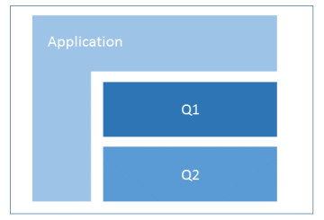

[           ](https://godoc.org/github.com/zew/go-questionnaire)    

# Go-Questionnaire

Creating and serving questionnaires in flexible column layout.  
Automatic desktop and mobile layout.

## Status

Version 1.1

Productive use at our research institute.

## Requirements

Go Version 1.__10__

## Semantics

* A `survey` is a `questionnaire` with one or more `waves` (repetitions).

## Usage

### Create questionnaire and logins

* Login as admin at https://dev-domain:port/survey/login-primitive

* Create a questionnaire template - as JSON file  
 https://dev-domain:port/survey/generate-questionnaire-templates

* Generate login hashes for the survey id and wave id above   
   i.e.  https://dev-domain:port/survey/generate-hashes?wave_id=2018-07&survey_id=fmt   
  yielding
  
      /survey?u=99000&survey_id=fmt&wave_id=2018-07&h=bc11262f8ce8dda558de9a0ffa064941
      ...

### Participant login and reset

* Participants can now use these login links to [access the questionnaire](https://dev-domain:port/survey?u=98991&survey_id=fmt&wave_id=2018-07&h=4059d765e4a4f211658373c07c5affb9)   

* Once logged in, they can [re-access the questionnaire](https://dev-domain:port/survey)

* For testing purposes, you may [reset the questionnaire](https://dev-domain:port/survey/reload-from-questionnaire-template?u=98991&survey_id=fmt&wave_id=2018-07&h=4059d765e4a4f211658373c07c5affb9)

### Setup

Install and setup [golang](https://golang.org/doc/install)

    cd $HOME/go/src/github.com/zew
    go get -u github.com/zew/go-questionnaire
    cd go-questionnaire
    mv config-example.json  config.json  # adapt to your purposes
    mv logins-example.json  logins.json  # dito
    touch ./templates/main_desktop_[survey].css # put your site's styles here
    go build
    ./go-questionnaire                   # under windows: go-questionnaire.exe

More info in [deploy on linux/unix](./static/doc/linux-instructions.md)

### Packages

* Package `qst` contains generic functions to create questionnaires.

* Package `generators` _uses_ qst for creating specific questionnaires.  

* Package `lgn` contains several authentication schemes for participants.

* Package `main` serves questionnaires via http(s).  
with automatic `Lets encrypt` certification.

* Directory `responses` stores indididual answers  
 (and initial questionnaire templates).

* There are global translations as well as  
 questionnaire specific multi-language strings.  
 Global hyphenizations helps with long words on mobile devices.

* Common proof functions prevent duplicate question keys  
 or missing translations.

* Survey results are pulled in by the `transferrer`,  
 aggregating responses into a CSV file.  
 `transferrer` logic is agnostic to questionnaire structure.

* The `updater` subpackage automates in-flight changes to the questionnaire.  
No need for database "schema" artistry.  

## Data thrift

* Surveys contain no personal data - only a participant ID, the questions and the answers.

* The `transferrer` pulls in the responses from an internet server.

* Once inside your organization, the results are fed into any CSV or JSON reading application.

## More features

* All content and all results are driven  
 by __JSON files__.  
 No database required.

* Server side validation.  
 An extensible set of number validation functions can be assigned to each field.

* Client side JS validation is deliberately omitted;  
   [a would-be JS client lib](http://www.javascript-coder.com/html-form/form-validation.phtml)

* Dynamic textblocks such as `RepsonseStatistics` are available.  
 Inputs values and user attributes can be accessed.

* Package `systemtest` performs a full circle roundtrip - filling out all available questionnaires  
and comparing the server JSON file with the entered data.  
Both, mobile and desktop version are tested.  
See the `travis-ci` build logs for details.

* Load testing script for 50 concurrent requests in `Python`.

### Design and Layout

* Each row can have a different number of columns.

* Every label and form element has its individual column width (`ColSpanLabel` and `ColSpanControl`)

* Each label or form element can be styled additionally (`CSSLabel` and `CSSControl`)

* Global layout elements can be adapted using `main_desktop_[survey].css` and  `main_mobile_[survey].css`.

#### Page navigation sequence - special pages

* Automatic navigation buttons and progress bar are provided for desktop and mobile layout.

In addition:

* Pages can be navigated by page number sequence using http params `previous` and `next` 

* Pages can be navigated using `page` = [0,1,...] parameter

* Page property `NoNavigation` decouples the page from the navigational sequence.  
 They are exempt from `previous` and `next`.  
 Such pages can be reached by setting submit buttons to their index value.  
 Useful for greeting- and goodbye-pages.

#### Defining questionnaires by code or by JSON file

At inception we envisioned a JSON schema validator  
and questionnaire creation by directly editing of JSON files  
but that remains as elusive as it did with XML.

### Layout concept

#### Accepted solution

Considering `float-left` or `inline-block`, we chose `fixed table` layout.  
We need this full-fledged markup, since mere CSS classes such as `<div style='display: table/table-row/table-cell'` do not support colspan or rowspan functionality.

Each `page.Width` can be adjusted for each page.
Squeezing or stretching all rows equally.
Page remains horizontally _centered_.

Each `group.Width` can be adjusted.  
The group can be left-aligned (picture) or right-aligned.

Each group has flexible number of columns.
The number of columns is deliberately not standardized on hundred,
so that odd distributions are possible - i.e. seven columns.

The inputs are fitted in. Usually an input occupies one column 
for its label and another column for its control part.
These numbers are customizable, so that any distribution
of labels and controls on an arbitrary grid is possible.

The layout engine creates new rows, if the inputs have filled up
the number of columns defined per group.

Use textblocks with `&nbsp;` to create empty space.

Group property `OddRowsColoring` to activate alternating background

The table border can be set via ./templates/main_desktop_[survey].css  
`table.bordered td { myBorderCSS }`

Vertical alignment is baseline for everything outside the input tables.
Input tables are vertically middled.

We might introduce vertical alignment control in future  
(InputT.VAlignLabel and InputT.VAlignControl).

#### Rejected solutions

Inline block suffers from the disadvantage, that 
the white space between inline block elements subtracts from the total width.
The column width computation must be based on a compromise slack of i.e. 97.5 percent.

Stacking cells wit `float:left` takes away the nice vertical middle alignment of the cells.

### Mobile layout

go-questionnaire has a _separate_ layout for mobile clients.
Hybrid solutions (_mobile first_) were considered complex and insufficient.

The HTML rendering of groups and inputs remains unchanged.
Global layout template and CSS files are different.
Instead of progress bar and footer navigation, mobile clients get a `mobile menu`.

The mobile layout is free of any JavaScript.

Switching is done based on the user agent string, but can be overridden by URL parameter `mobile`:  
0 - automatic. 1 - mobile forced. 2 - desktop forced.

Table layout `fixed` must be relinguished, otherwise labels and controls are cropped on devices with very small width.

Soft hyphenization is key to maintaining layout on narrow displays.  
Package `trl` contains a map `hyph` containing manually hyphenized strings.  
These are applied to all strings of any questionnaire at JSON creation time.

Mobile layout was tested with `crossbrowsertesting.com`.

### Randomization for scientific studies - shuffling of input order

* The order of inputs on pages can be randomized (shuffled).

* Shuffling is random, but deterministically reproducible for user ID and page number.

* Questionnaire property `variations` sets the number of different classes of shufflings.  
 For example, if `variations==2`, even and odd user IDs get the same  
 ordering when on same page.  

* `variations` should be set to the maximum number of inputs across pages.

* [Shufflings can be exported for use in related applications](https://dev-domain:port/survey/shufflings-to-csv)

## Optimizations

* Layout: Table data is currently aligned vertically middled.  
 Sometimes it should be configurable to baseline.

* The transferrer could truncate the pages from the online JSON files  
 leaving only user ID, completion time and survey data.

* For each user, only the responses could be saved to session/JSON; not the entire questionnaire data.  
 The responses could be merged into the questionnaire based on input name.

* The generators could be compiled into independent executables.  
 They could then be executed on the command line with the parameters as JSON file.

* Finish page and finish field could be harmonized.  
 Currently one can either generate one's own final page (in the example of the peu2018 survey).  
 Or one can set the "finalized" field and then gets system wide: You finished ... at ...

## Possible enhancements

* Adding a `Docker` script?  
 It would mostly contain the instructions of `linux-instructions.md`.

* Migrate file storage to GoCloud library and make  
deployable on Google Appengine or AWS without EBS (elastic block devices)?  
To be implemented into the load/save() methods of ConfigT, LoginsT and QuestionnaireT.

## About Go-App-Tpl

* Go-Questionnaire is based on Go-App-Tpl

* Go-App-Tpl is a number of packages for building go web applications.  

It features

* Http router with safe settings and optional https encryption

* Session package by Alex Edwards

* Configurable url prefix for running multiple instances on same server:port

* Middleware for logging, access restrictions etc.

* Middleware catches request handler panics

* Static file handlers

* JSON config file with reloadable settings 

* JSON logins file, also reloadable

* Handlers for login, changing password, login by hash

* Site layout template with jQuery from CDN cache; fallback to localhost 

* Multi language strings

* Templates having access to session and request

* Stack of dynamic subtemplate calls 

* Template pre-parsing (`bootstrap`), configurable for development or production

* Markdown file handler, rewriting image links 

* Multi language markdown files

* Shell script to control application under Linux

* CSRF and XSS defence

## Technical design guidelines

* Subpackaging is done by concern, neither too amorphous nor too atomic.

* Go-App-Tpl has no "hooks" or interfaces for isolation of "framework" code.  
 Just copy it and add your handlers.  
 Future updates can be merged.