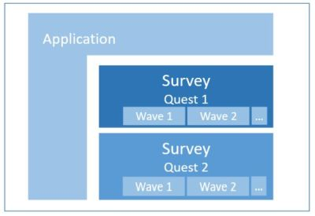

# Go-Questionnaire

                      

<!-- 

&nbsp;

&nbsp;
 
-->

* Creating and serving questionnaires

* Precise layout - no HTML fumble

* Automatic mobile version

## Status

Version 1.2

Productive use at our research institute.

## Requirements

Go Version 1.__11__

### Non-technical properties

* Any number of surveys via single server - any path

* Secure login URLs < 65 characters in size

* Shortcut logins `example.com/d/A5FE3P`

* Automatic smartphone version

* Simple design of new questionnaires

* Layout freedom - without HTML fumbling

* Support for any number of languages - Polish, Russian, Chinese

* Text blocks, support pages in several languages - written in simple `markdown` format

* Fully dynamic questions based on login profile  

  * Distinct questions depending Euro membership

  * Distinct questions by industry sector

  * Dynamic questions based on previous answers

* Customization for each wave

  * Reference interest rates in question text

* Order of questions randomizable, but constant for each participant

* Easy changes during survey time; i.e. typos or question rewording

* Universal CSV export directly available to the researcher running the survey

* Documentation

* Open source license

* Published on github.com

### Partly technical properties

* Ready for deployment on [Google App Engine](https://en.wikipedia.org/wiki/Google_App_Engine)  
by using [gocloud blob](https://godoc.org/gocloud.dev/blob) for local file system and google buckets.

* `Docker` technology for easy installation on any cloud server

* Builtin `https` self configuration

* `CSRF` and `XSS` hack defense

* Consistence check for questionnaires - no duplicate field names, no missing translations

* Server self test - checks correctness of participant data entry for each questionnaire

* All content and all results are driven  
 by __JSON files__.  
 No database required.

* Data thrift: Surveys contain no personal data - only a participant ID, the questions and the answers.

* Stress test - 60 participants at once

### Boring properties

* Extensible set of validation functions easily assignable to each field.  
 Server side validation - no client side validation.

* For example `must ; inRange20` or only `inRange100` or only `must`

### Technical properties

* `loadtest` performs 60 concurrent requests 1.41 seconds - on 2018 Lenovo Notebook.

* Server self test on `travis-ci`; see build logs for details.

* The `transferrer` pulls in the responses from an internet server. Once inside your organization, the results are fed into any CSV or JSON reading application.

## Semantics

* This application serves any number of `surveys`.

* A `survey` is a `questionnaire` with one or more `waves` (repetitions).

## Setup

Install and setup [golang](https://golang.org/doc/install)

    cd $HOME/go/src/github.com/zew
    go get -u github.com/zew/go-questionnaire
    cd go-questionnaire
    mv config-example.json  config.json  # adapt to your purposes
    mv logins-example.json  logins.json  # dito
    touch ./templates/main_desktop_[survey].css # put your site's styles here
    go build
    ./go-questionnaire                   # under windows: go-questionnaire.exe

More info in [deploy on linux/unix](./static/doc/linux-instructions.md)

## Create new questionnaire `myquest`

  

* Copy `generators/example` to `generators/myquest`

* Open `generators/myquest/main.go`  
and change package name: `package myquest`

* Add your new questionnaire to `generators/registry.go`  
`"myquest": myquest.Create,`

* In `generators/myquest/main.go`  
under `page := q.AddPage()` you can add  
additonal `pages`, `groups` and `inputs`.

* Additional groups are to change column layout within a page. Details below.

### Input types

* `text`       - your classic text input
* `number`     - number input - mobile browsers show the numbers keyboard
* `textarea`   - multi line text input
* `dropdown`   - list of fixed choices
* `checkbox`   - yes/no input
* `radiogroup`, `checkboxgroup` - fields of choices - helpers for horizontal and vertical display (see flit example)
* `textblock`  - block of text without input
* `button`     - submit button
* `dynamic`    - any input that depends on user properties or wave-specific data

Each input can have a multi-language label, -description, a multi-language suffix and a validation function.

Each input has a column span and an alignment for its label and for its input-field.

## Create survey and logins

If you have created your survey `myquest` you need to restart the application.

* Login as admin at https://dev-domain:port/survey/login-primitive

* Create a questionnaire template - as JSON file  
 https://dev-domain:port/survey/generate-questionnaire-templates

* Generate login hashes for the survey id and wave id above  
   i.e.  https://dev-domain:port/survey/generate-hashes?wave_id=2018-07&survey_id=fmt  
  yielding
  
      /survey?u=99000&sid=fmt&wid=2018-07&h=57I7UVp6
      ...

### Participant login and reset

* Participants can now use these login links to [access the questionnaire](https://dev-domain:port/survey?u=98991&survey_id=fmt&wave_id=2018-07&h=4059d765e4a4f211658373c07c5affb9)

* Once logged in, they can [re-access the questionnaire](https://dev-domain:port/survey)

* For testing purposes, you may [reset the questionnaire](https://dev-domain:port/survey/reload-from-questionnaire-template?u=98991&survey_id=fmt&wave_id=2018-07&h=4059d765e4a4f211658373c07c5affb9)

## Deploy to appengine

### Docs

* [runtime](https://cloud.google.com/appengine/docs/standard/go112/runtime)
* [environment_variables](https://cloud.google.com/appengine/docs/standard/go112/config/appref#environment_variables)

### Remote

#### Deploy

    gcloud config set project "financial-literacy-test"
    gcloud app deploy
    Y
    # 

Read the logs

    gcloud app logs tail -s default

Open in browser

    gcloud app browse

#### URLs

* [Frontend](https://financial-literacy-test.appspot.com)
* [Backend](https://console.cloud.google.com/home/dashboard?project=financial-literacy-test)
* [Datastore](https://console.cloud.google.com/storage/browser/financial-literacy-test.appspot.com/?project=financial-literacy-test&src=ac)

#### Creation of signed URLs via cloud.google.com/go/storage

    SET   GOOGLE_APPLICATION_CREDENTIALS=c:\Users\pbu\.ssh\google-cloud-rentomat-creds.json
    ECHO %GOOGLE_APPLICATION_CREDENTIALS%

### Local

    dev_appserver.py app.yaml
    "c:\Program Files (x86)\Google\Cloud SDK\google-cloud-sdk\platform\bundledpython\python.exe" "c:\Program Files (x86)\Google\Cloud SDK\google-cloud-sdk\bin\dev_appserver.py" app.yaml

### Packages

* Package `qst` contains generic functions to create questionnaires.

* Common proof functions in `qst` prevent duplicate question keys  
 or missing translations.

* Package `generators` _uses_ qst for creating specific questionnaires.  

* Package `lgn` contains three authentication schemes for participants.  
  * Regular login via username and password.
  * Login via URL parameters for user ID, survey ID, wave ID and profile ID plus hash.
  * Login via [hash ID](https://hashids.org) with above parameters configured in `directLoginRanges`.  
  * Login via anonymous ID [(example)](https://financial-literacy-test.appspot.com/create-anonymous-id) -  
   with above parameters configured in `directLoginRanges`.  
   The anonymous ID is converted into an integer, which is encoded as a hash ID.  
   [QR code example](http://financial-literacy-test.appspot.com/img/ui/qr.png).  
Profiles are configured key-value sets who are copied into the logged-in user's attributes.  
  This way any number of user properties can be specified, while the login URL remains short or ultra short.

* Package `main` serves questionnaires via http(s).  
with automatic `Lets encrypt` certification.

* Directory `app-bucket/responses` stores indididual answers  
 (and initial questionnaire templates).

* `trl` contains the type `multi-language string` and  
 a global hyphenizations map for mobile layout.

* `cfg` contains universal multi-language strings.  
 Each `questionnaire` contains specific multi-language strings.  

* Package cloudio is a convenience wrapper around [Gocloud blob](https://godoc.org/gocloud.dev/blob)  
The entire persistence layer is moved from ioutil... to cloudio...  
Thus the application can be hosted by cloud providers with buckets or on classical webservers.

* Survey results are pulled in by the `transferrer`,  
 aggregating responses into a CSV file.  
 `transferrer` logic is agnostic to questionnaire structure.

* The `updater` subpackage automates in-flight changes to the questionnaire.  
No need for database "schema" artistry.  

### Design and Layout

* Each row can have a different number of columns.

* Every label and form element has its individual column width (`ColSpanLabel` and `ColSpanControl`)

* Each label or form element can be styled additionally (`CSSLabel` and `CSSControl`)

* Global layout elements can be adapted using `main_desktop_[survey].css` and  `main_mobile_[survey].css`.

#### Page navigation sequence - special pages

* Automatic navigation buttons and progress bar are provided for desktop and mobile layout.

In addition:

* Pages can be navigated by page number sequence using http params `previous` and `next`

* Pages can be navigated using `page` = [0,1,...] parameter

* Page property `NoNavigation` decouples the page from the navigational sequence.  
 They are exempt from `previous` and `next`.  
 Such pages can be reached by setting submit buttons to their index value.  
 Useful for greeting- and goodbye-pages.

#### Defining questionnaires by code or by JSON file

At inception we envisioned a JSON schema validator  
and questionnaire creation by directly editing of JSON files  
but that remains as elusive as it did with XML.

### Layout concept

#### Accepted solution

Considering `float-left` or `inline-block`, we chose `fixed table` layout.  
We need this full-fledged markup, since mere CSS classes such as `<div style='display: table/table-row/table-cell'` do not support colspan or rowspan functionality.

Each `page.Width` can be adjusted for each page.
Squeezing or stretching all rows equally.
Page remains horizontally _centered_.

Each `group.Width` can be adjusted.  
The group can be left-aligned (picture) or right-aligned.

Each group has flexible number of columns.
The number of columns is deliberately not standardized on hundred,
so that odd distributions are possible - i.e. seven columns.

The inputs are fitted in. Usually an input occupies one column 
for its label and another column for its control part.
These numbers are customizable, so that any distribution
of labels and controls on an arbitrary grid is possible.

The layout engine creates new rows, if the inputs have filled up
the number of columns defined per group.

Use textblocks with `&nbsp;` to create empty space.

Group property `OddRowsColoring` to activate alternating background

The table border can be set via ./templates/main_desktop_[survey].css  
`table.bordered td { myBorderCSS }`

Vertical alignment is baseline for everything outside the input tables.
Input tables are vertically middled.

We might introduce vertical alignment control in future  
(InputT.VAlignLabel and InputT.VAlignControl).

#### Rejected solutions

Inline block suffers from the disadvantage, that 
the white space between inline block elements subtracts from the total width.
The column width computation must be based on a compromise slack of i.e. 97.5 percent.

Stacking cells wit `float:left` takes away the nice vertical middle alignment of the cells.

### Mobile layout

go-questionnaire has a _separate_ layout for mobile clients.
Hybrid solutions (_mobile first_) were considered complex and insufficient.

The HTML rendering of groups and inputs remains unchanged.
Global layout template and CSS files are different.
Instead of progress bar and footer navigation, mobile clients get a `mobile menu`.

The mobile layout is free of any JavaScript.

Switching is done based on the user agent string, but can be overridden by URL parameter `mobile`:  
0 - automatic. 1 - mobile forced. 2 - desktop forced.

Table layout `fixed` must be relinguished, otherwise labels and controls are cropped on devices with very small width.

Soft hyphenization is key to maintaining layout on narrow displays.  
Package `trl` contains a map `hyph` containing manually hyphenized strings.  
These are applied to all strings of any questionnaire at JSON creation time.

Mobile layout was tested with `crossbrowsertesting.com`.

### Randomization for scientific studies - shuffling of input order

* The order of inputs on pages can be randomized (shuffled).

* Shuffling is random, but deterministically reproducible for user ID and page number.

* Questionnaire property `variations` sets the number of different classes of shufflings.  
 For example, if `variations==2`, even and odd user IDs get the same  
 ordering when on same page.  

* `variations` should be set to the maximum number of inputs across pages.

* [Shufflings can be exported for use in related applications](https://dev-domain:port/survey/shufflings-to-csv)

## Optimizations

* Layout: Table data is currently aligned vertically middled.  
 Sometimes it should be configurable to baseline.

* The transferrer could truncate the pages from the online JSON files  
 leaving only user ID, completion time and survey data.

* The generators could be compiled into independent executables.  
 They could then be executed on the command line with the parameters as JSON file.

* Finish page and finish field could be harmonized.  
 Currently one can either generate one's own final page (in the example of the peu2018 survey).  
 Or one can set the "finalized" field and then gets system wide: You finished ... at ...

## Open / todo

* Templates and CSS files should go to `app-bucket` dir -  
take implementation from project tfre  
remove bootstrap.go template creation  
but adapt generators.SurveyGenerate()

* Should we have a checkbox where the control comes first?

* Document the label / checkbox vertical case

* Why is page width 70% not always rendered?

## Possible enhancements

* Revolving and compressing logfiles

    import "gopkg.in/natefinch/lumberjack.v2"
    log.SetOutput(&lumberjack.Logger{
        Filename:   LOG_FILE_LOCATION,
        MaxSize:    500, // MB
        MaxBackups: 3,
        MaxAge:     28,   //days
        Compress:   true, // disabled by default
    })

* The regular login URL was shortened.  
Direct logins via hash-ids are also supported.  
 [A URL shortening service](https://github.com/zew/urlshort) should not be required

* Hash length for login is hard coded to 5 digits.  
We could make it configurable per questionnaire, code being cumbersome.

## About go-app-tpl - extremely technical properties

* Go-Questionnaire is based on go-app-tpl

* go-app-tpl is a number of packages for building go web applications.  

It features

* Http router with safe settings and optional https encryption

* Session package by Alex Edwards

* Configurable url prefix for running multiple instances on same server:port

* Middleware for logging, access restrictions etc.

* Middleware catches request handler panics

* Multi language strings

* Static file handlers

* Markdown file handler, rewriting image links

* Multi language markdown files

* JSON config file with reloadable settings

* JSON logins file, also reloadable

* Handlers for login, changing password, login by hash ID

* CSRF and XSS defence

* Site layout template with jQuery from CDN cache; fallback to localhost

* Templates having access to session and request

* Stack of dynamic subtemplate calls

* Template pre-parsing (`bootstrap`), configurable for development or production

* Shell script to control application under Linux

* [Dockerfile](https://en.wikipedia.org/wiki/Docker_%28software%29) to deploy on modern cloud servers

* Package `cloudio` wraps all io operations into [Gocloud blob functionality](https://godoc.org/gocloud.dev/blob).  
Thus the application can be hosted by cloud providers with buckets *or* on servers with plain old hard disks.

* Package `sessx` can store sessions in a Redis server, keeping sessions sticky on autoscaling app engine deployments, otherwise fallback to local memory store.

* Package `stream` serves huge files without memory consumption in a protected way.

* Package `detect` discovers mobile clients

* Package `struct2form` generates HTML forms alone from structs with comments

* Package `graph` creates interactive SVG graphs

## Technical design guidelines

* Subpackaging is done by concern, neither too amorphous nor too atomic.

* go-app-tpl has no "hooks" or interfaces for isolation of "framework" code.  
 Clone it and add your handlers.  
 Future updates will be merged.

## gocloc

Language | files | blank | comment | code
--- | --- | --- | --- | ---
Go generic | 51 | 1313 | 1267 | 6860
Go questionnaires | 12 |  602 |  273 |  5281
CSS | 12 | 261 | 144 | 713
Markdown | 27 | 485 | 0 | 727
HTML | 6 | 96 | 31 | 319
Python | 1 | 31 | 16 | 94
Bourne | Shell | 3 | 17 | 19 | 76
