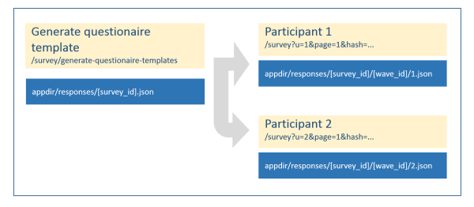
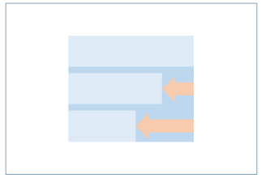
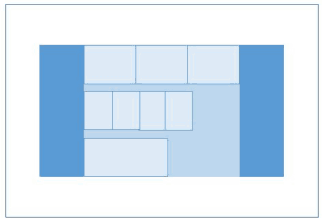
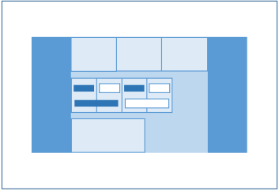

 
 
[           ](https://godoc.org/github.com/zew/go-questionaire)    

# Go-Questionaire 

Creating and serving questionnaires in flexible column layout.  
Automatic desktop and mobile layout.

## Status

Version 1.0

Productive use at our research insitute.

## Requirements

Go Version 1.__10__

## Usage

Install and setup [golang](https://golang.org/doc/install)

    cd $HOME/go/src/github.com/zew
    go get -u github.com/zew/go-questionaire
    cd go-questionaire
    mv config-example.json  config.json  # adapt to your purposes
    mv logins-example.json  logins.json  # dito
    touch ./templates/site.css           # put your site's styles here
    go build
    ./go-questionaire                    # under windows: go-questionaire.exe

More info in [deploy on linux/unix](./static/doc/linux-instructions.md)

#### Create questionaire and logins

* Login as admin at https://dev-domain:port/survey/login-primitive

* Create a questionaire template - as JSON file  
 https://dev-domain:port/survey/generate-questionaire-templates

* Generate login hashes for the survey id and wave id above   
   i.e.  https://dev-domain:port/survey/generate-hashes?wave_id=2018-07&survey_id=fmt   
  yielding
  
      /survey?u=99000&survey_id=fmt&wave_id=2018-07&h=bc11262f8ce8dda558de9a0ffa064941
      ...

#### Participant login and reset

* Participants can now use these login links to [access the questionaire](https://dev-domain:port/survey?u=98991&survey_id=fmt&wave_id=2018-07&h=4059d765e4a4f211658373c07c5affb9)   

* Once logged in, they can [re-access the questionaire](https://dev-domain:port/survey)

* For testing purposes, you may [reset the questionaire](https://dev-domain:port/survey/reload-from-questionaire-template?u=98991&survey_id=fmt&wave_id=2018-07&h=4059d765e4a4f211658373c07c5affb9)

## Semantics

* A `survey` is a `questionaire` with one or more `waves` (repetitions).

* Package `qst` contains generic functions to create questionaires.

* Package `generators` _uses_ qst for creating specific questionaires.  

* Package `lgn` contains several authentication schemes for participants.

* Package `main` serves questionaires via http(s). 

* Directory `responses` stores indididual answers  
(and initial questionaire templates).

* There are global translations as well as  
questionnaire specific multi-language strings.

* There are common functions preventing duplicate question keys  
 or missing translations.

* Survey results are pulled in by the `transferrer`,  
aggregating responses into a CSV file.

* In-flight changes to the questionnaire do not require any  
"schema" or configuration effort. 

## Data thrift

* Surveys contain no personal data - only a participant ID, the questions and the answers.

* The `transferrer` pulls in the responses from an internet server.

* Once inside your organization, the results are fed into any CSV or JSON reading application.

## More features

* All content and all results are driven  
by __JSON files__.

* No database required.

* Server side validation.  
An extensible set of number validation functions can be assigned to each field.

* Client side JS validation is deliberately omitted;  
   [a would-be JS client lib](http://www.javascript-coder.com/html-form/form-validation.phtml)

* Dynamic textblocks such as `RepsonseStatistics` are available, and can be easily added.

* Package `systemtest` performs full circle roundtrip - filling out all available questionaire 
and comparing the server JSON file with the entered data.  
Both, mobile and desktop version are tested.

* Load testing script for 50 concurrent requests.

### Design and Layout

* Each row can have a different number of columns.

* Every label and form element has its individual column width (`ColSpanLabel` and `ColSpanControl`)

* Each label or form element can be styled additionally (`CSSLabel` and `CSSControl`)

#### Page navigation sequence - special pages

* Automatic navigation buttons and progress bar are provided for desktop and mobile layout.

In addition:

* Pages can be navigated by page number sequence using http params `previous` and `next` 

* Pages can be navigated using `page` = [0,1,...] parameter

* Page property `NoNavigation` decouples the page from the navigational sequence.  
They are exempt from `previous` and `next`.  
Such pages can reached to by setting submit buttons to their index value.  
Useful for greeting- and goodbye-pages.

#### Defining questionaires by code or by JSON file

At inception we envisioned a JSON schema validator  
and questionaire creation by directly editing of JSON files  
but that remains as elusive as it did with XML.

### Layout concept

#### Accepted solution

Considering `float-left` or `inline-block`, we chose `fixed table` layout.

We need full fledged markup, since mere CSS classes such as `<div style='display: table/table-row/table-cell'` do not support colspan or rowspan functionality. 

Page width can be adjusted for each page. 
Squeezing or stretching all rows equally.
Page remains horizontally _centered_.

Each input group width can be adjusted.
The input group remains left-aligned.

Each input group has flexible number of columns.
It is deliberately not standardized on hundred,
so that odd distributions are possible - i.e. seven columns.

The inputs are fitted in. Usual an input occupies one column 
for its label and another column for its control part.
These numbers are customizable, so that any distribution
of labels and controls on an arbitrary grid is possible.

Use textblocks with `&nbsp;` to create empty space.

The layout engine creates new rows, if the inputs have filled up
the number of columns defined per group.

Group property `OddRowsColoring` to activate alternating background

The table border can be set via ./templates/site.css  
`table.bordered td { myBorderCSS }`

Vertical alignment is baseline for everything outside the input tables.
Input tables are vertically middled.

We might introduce InputT.VAlignLabel and InputT.VAlignControl to customize this in future.

#### Rejected solutions

Inline block suffers from the disadvantage, that 
the white space between inline block elements subtracts from the total width.
The column width computation must be based on a compromise slack of i.e. 97.5 percent.

Stacking cells wit `float: left` takes away the nice vertical middle alignment of the cells.

### Mobile layout

go-questionaire has a _separate_ layout for mobile clients.
Hybrid solutions (_mobile first_) were considered complex and insufficient.

The HTML rendering of groups and inputs remains unchanged.
Global layout template and CSS files are different.
Instead of progress bar and footer navigation, mobile clients get a `mobile menu`.

The mobile layout is free of any JavaScript.

Switching is done based on the user agent string, but can be overridden by `mobile` parameter.
0 - automatic. 1 - mobile forced. 2 - desktop forced.

Table layout `fixed` must be relinguished, otherwise labels and controls are cropped on devices with very small width.

### Randomization for scientific studies - shuffling of input order

* The order of inputs on pages can be randomized (shuffled).

* Shuffling is random, but reproducible for user ID and page number.

* Questionaire property `variations` sets the number of different classes of shufflings.  
For example, if `variations==2`, even and odd user IDs get the same 
ordering when on same page.  

* `variations` should be set to the maximum number of inputs across pages.

* [Shufflings can be exported for use in related applications](https://dev-domain:port/survey/shufflings-to-csv)

## Optimization

* Layout: Table data is currently aligned vertically middled.  
Sometimes it should be configurable to baseline. 

* The transferrer should truncate the pages from the online JSON files   
leaving only user ID, completion time and survey data.

* For each user, only the responses should be saved to session/JSON; not the entire questionaire data.  
The responses could be merged into the questionaire based on input name.

* The generators should be compiled into independent executables.  
They could then be executed on the command line with the parameters as JSON file.

## About Go-App-Tpl

* Go-Questionaire is based on Go-App-Tpl

* Go-App-Tpl is a number of packages for building go web applications.  

It features

  * Http router with safe settings and optional https encryption

  * Session package by Alex Edwards

  * Configurable url prefix for running multiple instances on same server:port

  * Middleware for logging, access restrictions etc.

  * Middleware catches request handler panics

  * Static file handlers
  
  * JSON config file with reloadable settings 

  * JSON logins file, also reloadable
  
  * Handlers for login, changing password, login by hash

  * Site layout template with jQuery from CDN cache; fallback to localhost 

  * Multi language strings

  * Templates having access to session and request

  * Stack of dynamic subtemplate calls 
  
  * Template pre-parsing, configurable for development or production

  * Markdown file handler, rewriting image links 
  
  * Multi language markdown files
  
  * Shell script to control application under Linux

  * CSRF and XSS defence

  

## Technical design guidelines

* Subpackaging is done by concern, neither too amorphous nor too atomic. 

* Go-App-Tpl has no "hooks" or interfaces for isolation of "framework" code.  
Just copy it and add your handlers. 

Future updates can be merged.

